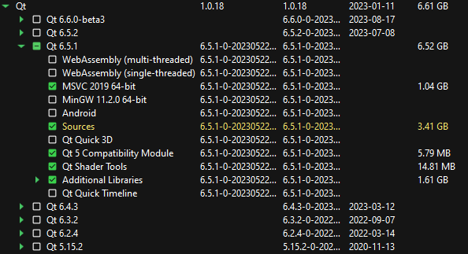
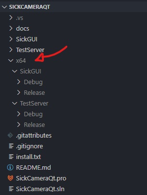

# SickCameraQt

Siemens Step 7 PLC interface for Sick Visionary-T Mini TOF camera with flexible image filtering.

## Installation

1. **Install Qt**
* [Download Qt 6.5.1](https://www.qt.io/download)
> **Note:** The program was written with Qt 6.5.1, but should be compatable with 6.x.x. If you do decide to use a version other than 6.5.1, you will have to set the SickGUI 'Configuration Properties \> Qt Project Settings \> Qt Installation' to the appropriate value.
* Follow the steps of the installer
* Select the following when prompted (this is what I *think* is the minimum required, but if you run into issues, you can always rerun the installer and update what components you want)

2. **Install OpenCV**
* [Download OpenCV 4.8.0](https://github.com/opencv/opencv/releases/tag/4.8.0)
* Set environment variable "OPENCV_DIR" to root install directory
* [Video walkthrough](./docs/videos/opencv_install_video.mp4)

3. **Install Boost**
* [Download Boost 1.8.3](https://www.boost.org/users/download/)
* Set environment variable "BOOST_DIR" to root install directory
* [Video walkthrough](./docs/videos/boost_install_video.mp4)

4. **Install Visual Studio 2022**
* [Download Visual Studio](https://visualstudio.microsoft.com/downloads/)
* Follow the steps of the installer and when prompted, check the "Desktop development with C++" workload
* Once installed, add "Qt Visual Studio Tools" extension
* Set environment variable VCINSTALLDIR (most likely "C:\\Program Files\\Microsoft Visual Studio\\2022\\Community\\VC")

> **Note:** Visual Studio needs to be closed and reopened to recognize changes in environment variables.

## Building

### Visual Studio

To build the project, open the solution file (SickCameraQt.sln) in Visual Studio. Once the solution loads, you will see two projects in the *'solution explorer'*: SickGUI and TestServer. SickGUI is the main project with TestServer just being useful for testing without an actual PLC. Both projects have a *'Release'* and *'Debug'* configuration.

> **Note:** The *'Debug'* configuration does not build with optimizations, so it can be **very slow**. Always use *'Release'* when distributing.

Select your desired configuration and then *'Build Solution'* either in the *'build'* tab or from the *'solution explorer'*. You should see the build progress in the *'output'* window. The build events/order is as follows (for SickGUI)

* Read Qt configuration
* Build C++ source (msvc)
* Run Qt Meta Object Compiler
* Run qtwindeploy
* Copy opencv dll's using xcopy

If all goes well, you should see a success message. If you get any errors, the *'output'* window should point you in the right direction on what to google, or you can open an new issue.

## Distributing

After building, Visual Studio will generate a *'./x64'* directory containing each project's build output. 

The TestServer project just contains the executable and the snap7 dll. SickGUI will contain the executable, Qt dll's, and a Visual C++ Redistributable installer. If you can build the project successfully then you won't have to run the Visual C++ installer but it may be necessary when deploying the application on a different computer. To deploy, follow these steps:

* Obtain build output (either by building from source or by downloading the [pre built binaries](https://github.com/NickTheWhale/SickCameraQt/releases))
* Transfer the entire contents of the build output to the target PC
* Run the Visual C++ Redistributable installer (likely called vc_redist.x64.exe)
* Setup the camera settings using [Sopas Engineering Tool](https://cdn.sick.com/us/en/) (optional)
* Modify configuration file

## Configuration

[Example configuration file](./configuration_example.ini)

The configuration file is loaded at application startup and is used to set the PLC and camera settings. 

## Prebuilt Binaries

If you just want to download the latest version without building from source, you can do so [here](https://github.com/NickTheWhale/SickCameraQt/releases).